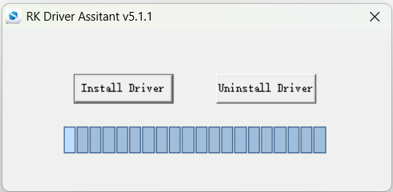
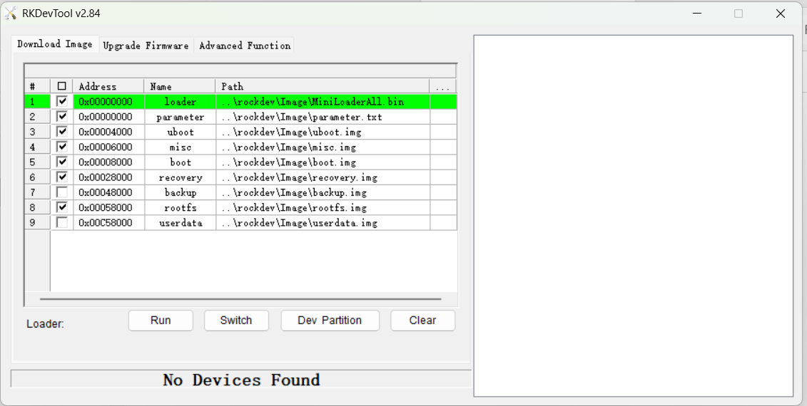
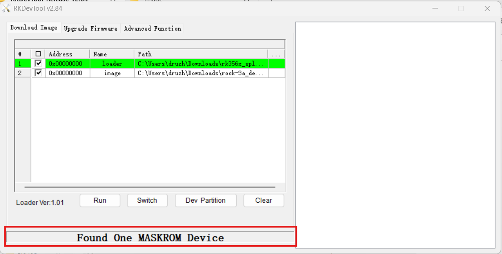
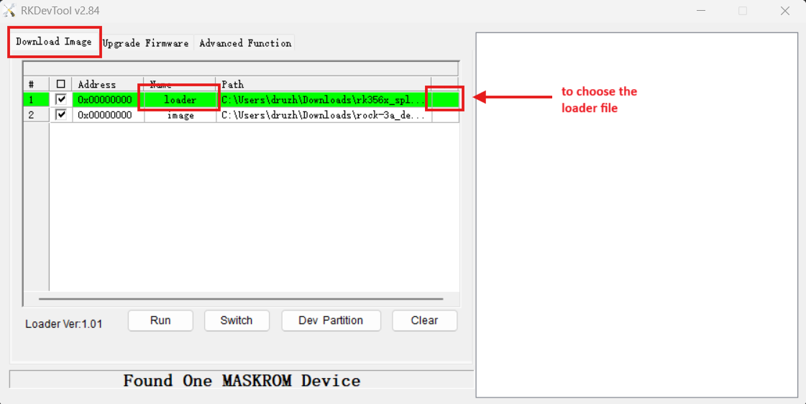
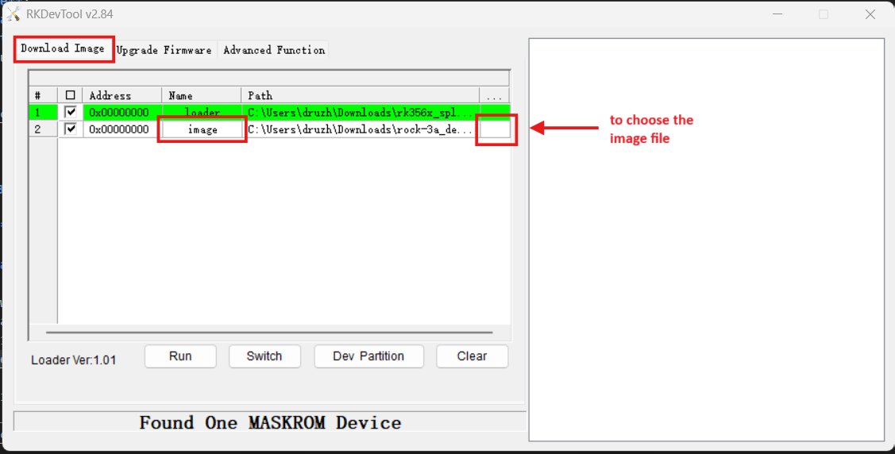
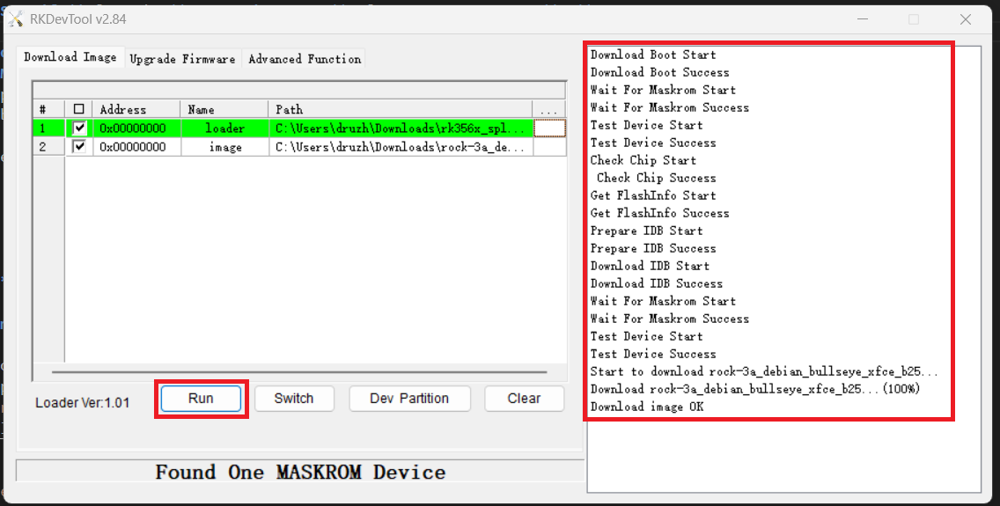

# Banana Pi R2 PRO – Setup & Flashing Guide

This repository provides a full guide on how to prepare and flash the **Banana Pi R2 PRO (Rockchip RK3568B2)** single-board computer. It includes instructions for OS installation, module setup, bug fixes, and ready-to-use scripts and tools.

## ✨ Purpose

The goal is to document a working and repeatable method to get the BPI R2 PRO up and running with a Linux-based OS, including firmware flashing and module installation.

---

## 🚀 Flashing OS to BPI R2 PRO

### 📥 Downloading Required Resources

1. **Download and install Rockchip USB Driver** 
   [Link](https://download.banana-pi.dev/d/ca025d76afd448aabc63/files/?p=%2FTools%2Fimage_download_tools%2FDriverAssitant_v5.11.zip) 
   

2. **Download RKDevTool v2.84**  
   [Link](https://download.banana-pi.dev/d/ca025d76afd448aabc63/files/?p=%2FTools%2Fimage_download_tools%2FUpdate-EMMC-Tools.zip)

3. **Download OS image**  
   [Link](https://github.com/radxa-build/rock-3a/releases/)
   For example was used rock-3a_debian_bullseye_xfce_b25.img.

4. **Download loader (bootloader)**  
   - Defualt:  
     [rk356x_spl_loader_ddr1056_v1.10.111.bin](https://github.com/radxa/rockchip-bsp/raw/master/tools/rk356x_spl_loader_ddr1056_v1.10.111.bin)

   - For RK3568 SB:  
     [rk356x_spl_loader_ddr1056_v1.12.109_no_check_todly.bin](https://github.com/radxa/rockchip-bsp/raw/master/tools/rk356x_spl_loader_ddr1056_v1.12.109_no_check_todly.bin)

---

### 🔌 Preparing BPI R2 PRO for Flashing

1. Open **RKDevTool_Release_v2.84**  
   

2. Disconnect the power adapter from the board.

3. Connect a **dual male USB cable** from the **top USB host port** of BPI R2 PRO to your **PC**.

4. **Enter USB download mode**:
   - Press and hold the **Maskrom** button (next to 3-pin UART header)
   - Connect the power adapter (or press the **RST** button if already connected)
   - Hold the **Maskrom** button for ~2 seconds, then release it

5. Your PC should recognize the device if the Rockchip USB driver was installed correctly.

---

### 💾 Flashing the OS to BPI R2 PRO

All steps are done inside **RKDevTool_Release_v2.84**.

1. Go to the **"Download Image"** tab.

2. In the list, find the row with name **loader**.  
   - Use the last column (path selector) to choose the file  
     `rk356x_spl_loader_ddr1056_v1.12.109_no_check_todly.bin`  
   

3. In the next row, rename it to **image** and select the downloaded OS image file  
   `rock-3a_debian_bullseye_xfce_b25.img`  
   

4. All other rows should be **unchecked or deleted** using right-click menu.

5. Click the **"Run"** button to start flashing  
   

6. Within a few minutes, the module will be flashed. After reboot, a login screen should appear.  
   - Default login for this image:  
     **Username**: `rock`  
     **Password**: `rock`

---

## ⚠️ Problems Encountered

1. **SD card damage with SD_FIRMWARE_TOOL**  
   - Using the official SD booting tool led to the **permanent damage of several SD cards**.  
   - One SD card was flashed successfully only once.  
   - Another card worked for a few flashes, then failed irreparably.

2. **Official images failed to flash**  
   - Flashing official images resulted in errors (details vary).  
   - Flashing **custom images from Google Drive** worked ([link](https://drive.google.com/drive/folders/1hnwcoPpNmWwCk9qxqjAeIQQEqt4mjjhG)), but created partitioning problems:
     - Only 6GB out of 14GB was available.
     - Attempts to resize or repartition failed with various tools.

---

### 🧪 Methods Attempted

#### Method 1: Flashing with SDBoot image (via "Upgrade Firmware")

- Download and extract an image built for **SDBoot**.
- Open **"Upgrade Firmware"** tab in **RKDevTool**.
- Select the `.img` file via the **Firmware** button.  
  (Validation takes some time.)
- Connect the module in **Maskrom mode** (same steps as above).
- Press **Upgrade** to flash.
- After flashing, the screen should display a login prompt:  
  **Login**: `bpi`  
  **Password**: `bananapi`

#### Method 2: Flashing with EMMCBoot (manual image layout)

- Download and extract an image built for **EMMCBoot**.
- Open **"Download Image"** tab in **RKDevTool**.
- For each image component (`rootfs.img`, `recovery.img`, `misc.img`, `uboot.img`, `boot.img`, `parameter.txt`, `MiniLoaderAll.bin` as loader), specify paths manually.
- Uncheck or remove rows that don’t match.
- Connect module in **Maskrom mode**.
- Click **Upgrade** to begin flashing.
- After flashing, the screen should display a login prompt:  
  **Login**: `bpi`  
  **Password**: `bananapi`
